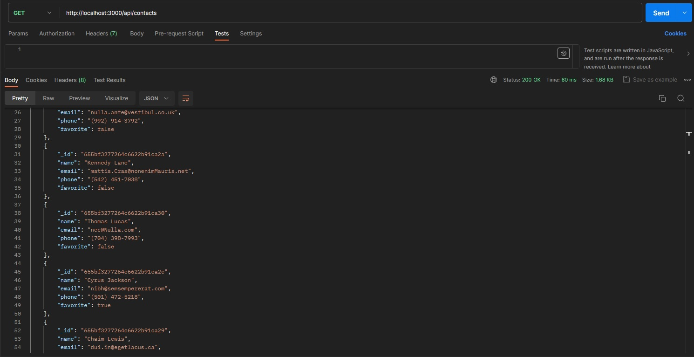
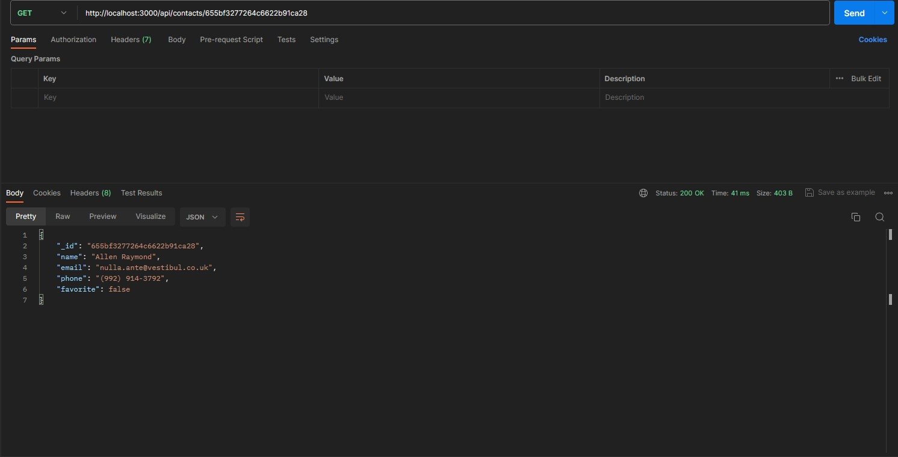
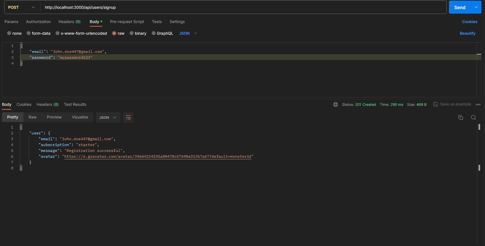

# ContactBook API

This project is a simple Node.js application that serves as an API for interacting with a MongoDB database. This application allows users to send requests to database and perform various operations on it such as: creating and updating contacts and users.

## Setting up App

Install requirements:

- **Node.js** (v18+)
- **MongoDB** database using MongoDB

### Install

1. Clone repository
2. Run `npm install` to install all dependencies
3. Update/Create(if missing) `.env` file in root directory.
4. Inside `.env` add two variables:
   - `DB_HOST`: This is your MongoDB database connection URL
   - `JWT_SECRET`: This is your secret key used for encrypting confidential informations like users passwords.

### Scripts

- `npm start` &mdash; Launching server
- `npm run start:dev` &mdash; Launching server in development mode
- `npm run lint` &mdash; Starts ESLint test
- `npm lint:fix` &mdash; Starts ESLint tests with automatic simple bug fixes.

### Usage

Server is set to run at http://localhost:<port>. Usually default port for most users is 3000.
Available endpoints:

#### Contacts:

`body` needs to be in JSON format

- GET `/api/contacts` - list of the contacts in database
- GET `/api/contacts/id` - list contact with given id
- POST `/api/contacts` - create new contact (requires `body` with `name, email, phone` fields)
- PUT `api/contacts/id` - updates existing contact with given id (requires `body` with `name, email, phone` fields)
- DELETE `api/contacts/id` - deletes existing contact with given id
- PATCH `api/contacts/id/favorite` - marks contact as favorite (require `body` with `favorite` field)

#### Users:

- Post `/api/users/signup` - creates new user (requires `body` with `email, password` fields)
- POST `/api/users/login` - logs in user (requires `body` with `email, password` fields)
- GET `/api/users/logout` - logs out user (requires authorization with `token` )
- GET `/api/users/current` - list currently logged user (requires authorization with `token`)
- PATCH `/api/users/avatars` - updates user's avatar (requires `.jpg` file, max 1 mb)

### Examples:

Examples of some requests using <a href="https://www.postman.com" target="_blank">Postman<a>.

GET `/api/contacts`

GET `/api/contacts/id`

POST `/api/users/signup`

